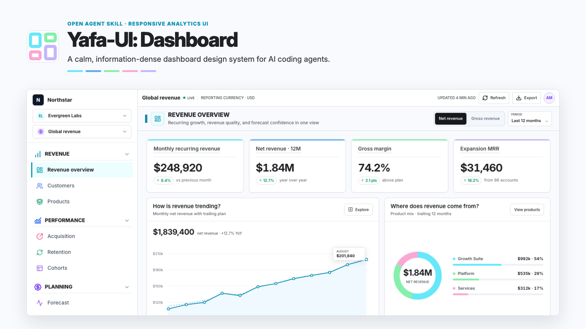
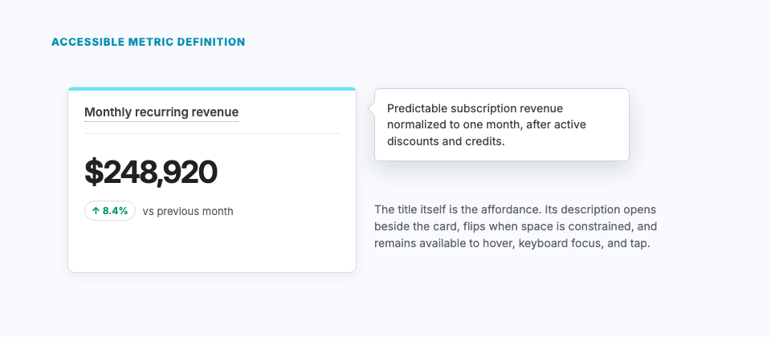
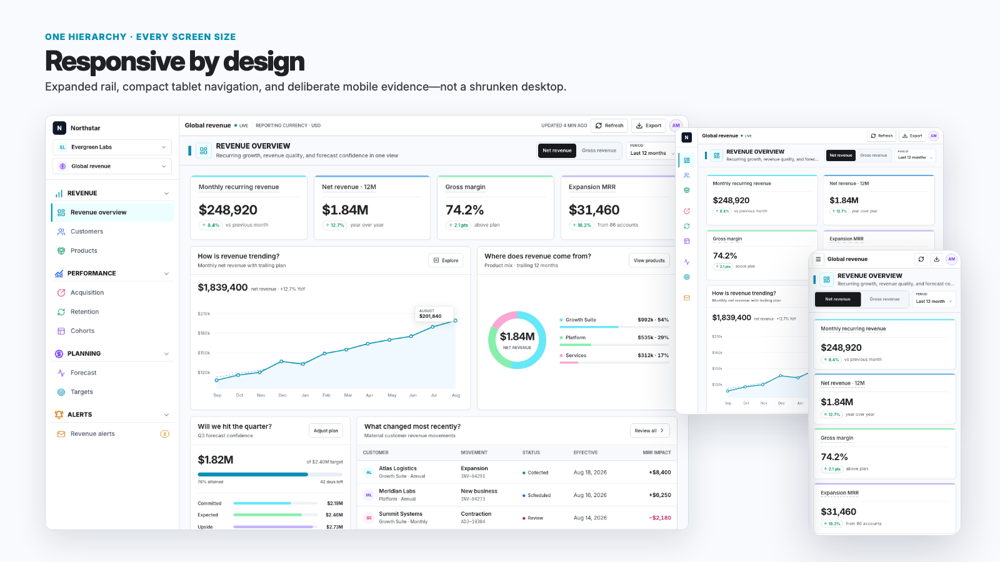
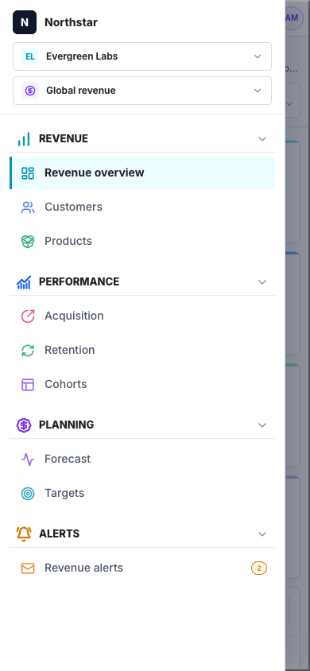
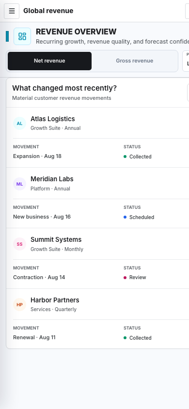

<p align="center">
  
</p>

<h1 align="center">Yafa-UI: Dashboard</h1>

<p align="center">
  An open Agent Skill for designing and implementing polished, responsive SaaS analytics and admin dashboards—with structured sidebar navigation, KPI cards, charts, tables, filters, accessible states, and deliberate mobile behavior.
</p>

<p align="center">
  <a href="https://skills.sh/rejourneyco/yafa-ui-dashboard"></a>
  <a href="https://rejourney.co/demo/general"></a>
  <a href="https://github.com/rejourneyco/yafa-ui-dashboard/blob/main/LICENSE"></a>
  
</p>



Yafa-UI: Dashboard is an instruction-based dashboard design system for AI coding agents—not a component library or template. It guides an agent working in your existing React, Next.js, Tailwind CSS, Vue, Svelte, or other frontend stack while preserving your product's architecture and brand.

Explore the [live Rejourney analytics dashboard demo](https://rejourney.co/demo/general) to see the sidebar, page header, KPI cards, charts, filters, and evidence surfaces that informed the skill.

## Install in one command

```bash
npx skills add rejourneyco/yafa-ui-dashboard
```

The installer discovers the root `SKILL.md` and lets you select supported agents. To install globally for several popular coding agents at once:

```bash
npx skills add rejourneyco/yafa-ui-dashboard \
  --global \
  --agent codex \
  --agent claude-code \
  --agent cursor \
  --agent github-copilot \
  --agent gemini-cli \
  --yes
```

The skill itself contains instructions, references, and image assets only. It has no executable hooks, telemetry, runtime package, or production dependency.

## Ask for a dashboard

```text
Use Yafa-UI: Dashboard to build a responsive revenue analytics dashboard
with MRR, net revenue, gross margin, forecasts, customer movements,
desktop sidebar navigation, and a deliberate mobile layout.
```

```text
Review this React and Tailwind admin dashboard with Yafa-UI: Dashboard.
Fix visual hierarchy, all-blue charts, pill-shaped actions, dense tables,
responsive breakpoints, and accessibility without changing the data model.
```

```text
Apply Yafa-UI: Dashboard to this Next.js product analytics page. Keep the
existing brand, but create a compact shell, KPI strip, primary chart,
evidence table, loading state, empty state, and mobile evidence cards.
```

## What the skill handles

- Dashboard UI design for SaaS, B2B, product analytics, revenue, business intelligence, and admin interfaces.
- A compact four-layer default for net-new dashboards—while preserving established host-product chrome when the dashboard is embedded.
- Semantic sidebar navigation with stable group colors, route-specific Lucide icons, active-state rails, collapse, resize, and mobile drawer behavior.
- Loaded Inter typography for new dashboards—or the host product's established typeface—with restrained weight, density, and numeric hierarchy.
- Multi-color KPI cards and data visualization without making the interface random or uniformly blue.
- Charts, rankings, filters, query builders, dense tables, evidence lists, maps, heat maps, and canvas-first workbenches.
- Responsive dashboard layouts at 320px, 390px, 768px, 1024px, and 1440px.
- Accessible focus, keyboard, touch, tooltip, drawer, loading, empty, partial-error, and full-error states.

## The visual grammar

Yafa-UI keeps most pixels neutral and assigns color deliberately:

| Role | Treatment |
| --- | --- |
| Canvas and chrome | White and `#f8fafd`, 1px neutral borders, little or no shadow |
| Route identity | One stable strong/soft color pair reused in navigation and page identity |
| KPI and chart data | Cyan, blue, green, pink, and violet mapped by meaning—not array order |
| Standard actions | Compact rectangles with 0–8px corners; no action bubbles |
| Status | A small semantic dot or icon plus plain text; never a status capsule |
| KPI delta | White/transparent capsule with neutral border; only the number is semantic-colored |
| Icons | Named Lucide icons with centralized route and section registries |

Standard KPI cards deliberately omit decorative upper-right icons. Their title uses a short dotted underline that exposes a description on hover, focus, and tap; the tooltip opens beside the title and flips to remain inside the viewport.



## Responsive dashboard behavior



- Below 768px, navigation becomes a focus-contained drawer and the page identity may stack above its lenses.
- At a desktop-quality header content width (about 720px+), page identity stays left and the complete lens/period cluster stays right in one row; narrower panes use a controlled non-overflow fallback.
- KPI grids move from one to two to four columns according to usable content width.
- Rich desktop rows become bounded table scrollers or deliberate mobile evidence cards; critical fields are not simply hidden.
- Charts reduce tick density before shrinking text, preserve series colors, and expose hover values through touch and keyboard.

<table>
  <tr>
    <td width="50%"></td>
    <td width="50%"></td>
  </tr>
  <tr>
    <td align="center"><strong>Accessible mobile navigation</strong></td>
    <td align="center"><strong>Mobile evidence instead of crushed tables</strong></td>
  </tr>
</table>

## Compatible coding agents

The repository follows the open Agent Skills `SKILL.md` format and works through the skills CLI with:

| Agent | Typical invocation or verification |
| --- | --- |
| OpenAI Codex | `$yafa-ui-dashboard` or the skills picker |
| Claude Code | `/yafa-ui-dashboard` |
| Cursor | Skills settings or `/yafa-ui-dashboard` |
| GitHub Copilot | Automatic skill matching in coding-agent workflows |
| Gemini CLI | `/skills list` and normal prompt matching |

It also works with other Agent Skills-compatible tools that can install a public GitHub skill repository.

## Repository structure

```text
.
├── SKILL.md                       # Machine-readable entrypoint and core rules
├── agents/openai.yaml             # Optional Codex UI metadata
├── references/
│   ├── dashboard-visual-system.md # Shell, typography, geometry, surfaces, tables
│   ├── color-system.md            # Route, analytical, semantic, and sidebar color
│   ├── icon-system.md             # Lucide selection, scale, registry, accessibility
│   ├── responsive-adaptation.md   # Phone, tablet, laptop, desktop behavior
│   └── review-checklist.md        # Visual and implementation QA
└── assets/                        # Code-native mark and documentation screenshots
```

Start with [SKILL.md](SKILL.md). The agent loads only the focused reference needed for the current dashboard task.

## Design boundaries

Yafa-UI is intended for primary authenticated analytics and data-heavy product surfaces. It should not automatically restyle marketing pages, authentication, setup wizards, account or billing settings, maintenance screens, or unrelated detail workflows. Those areas may share shell tokens while keeping their own task-specific design.

## Contributing

See [CONTRIBUTING.md](CONTRIBUTING.md). Keep the skill portable, evidence-based, framework-neutral, and free of private product paths or generated interface artwork.

## License

[MIT](LICENSE) © 2026 Rejourney.
